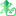

#  CoinGecko Candy Collector

If you have a tab open with <https://www.coingecko.com/en/candy> (or other localization) this extension automatically injects JavaScript to periodically check and click on the candy collect button when it is available.

The extension icon also has an indicator if you do not have the tab open, and can be clicked to open/select the candy tab.

Released on [Chrome Web Store](https://chrome.google.com/webstore/detail/ogdmacmpiojggeojaapfapjljcodigah) and [Firefox Add-ons](https://addons.mozilla.org/en-US/firefox/addon/coingecko-candy-collector).

Functionality tested on 2024-04-26.

## Changelog

### 1.0.3

Fixed collection, due to change in DOM.

### 1.0.2

Fixed collection, due to change in DOM.

### 1.0.1

Fix for running over a long time. Output is now gathered in background page.

### 1.0.0

Initial store release. Basic functionality.

## License

The software in this repo is released under [MIT](https://opensource.org/licenses/MIT), also found in the `LICENSE` file.

## Credits

Logo icon made by [Freepik](https://www.flaticon.com/authors/freepik) from [Flaticon](https://www.flaticon.com/).

## Notice

This project is not affiliated, associated, authorized, endorsed by, or in any way officially connected with CoinGecko, or any of its subsidiaries or its affiliates. The official CoinGecko website can be found at <https://www.coingecko.com>.

The name CoinGecko as well as related names, marks, emblems and images are registered trademarks of their respective owners.
